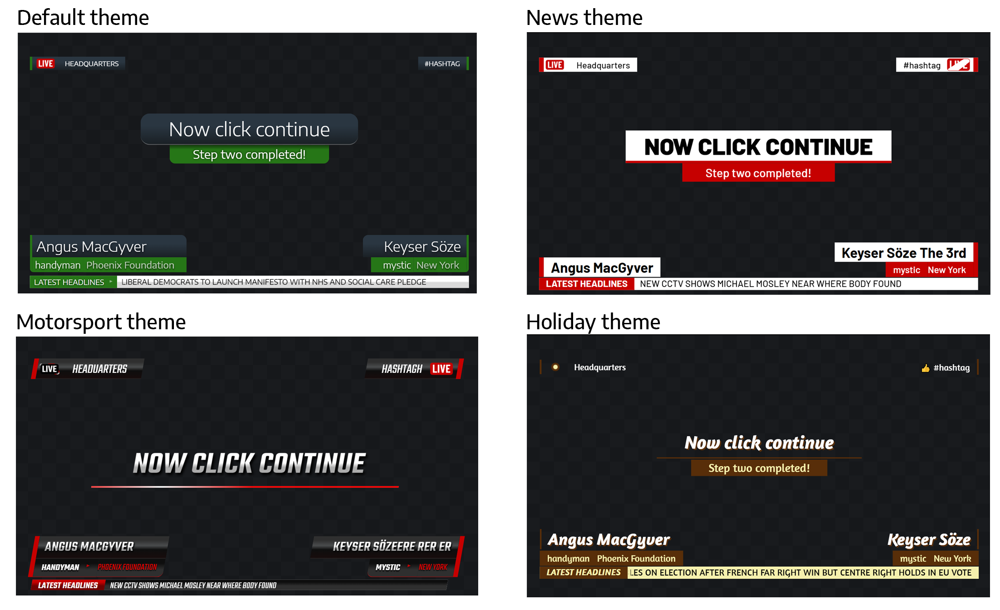

# SPX Template Demo Pack 1.3

> Updated 2022-06-10


This starter pack consists of a few example HTML -templates to be used for testing [**SPX Graphics Controller**](https://www.github.com/TuomoKu/SPX-GC/) for controlling HTML-based graphics in [CasparCG](https://casparcg.com/), [OBS](https://obsproject.com/), [Wirecast](https://www.telestream.net/wirecast/), [vMix](https://www.vmix.com/) and much much more.

<BR>

> Custom made and branded templates should always be used in production but these might help while getting to know the system. If you need **Creative Services** for designing and developing custom templates, please [get in touch with SPX Creative Services](https://spx.graphics/contact).

<BR>


## Installation
 - Install **SPX Graphics Controller** from [spx.graphics](https://spx.graphics) if not installed.
 - This template pack comes with the software, so no additional installations are needed. 
 - in SPX, open a project and add templates into it
 - open any rundown in that project and add templates to rundown.
 - fill in the templates and play.

 > When developing templates please see the **source files** for additional comments, instructions and links to external docs (such as [SPX Knowledge Base](http://spxgc.tawk.help)) or libraries.

<BR>

## List of templates
The pack has the following templates to demonstrate various capablities of SPX Graphics Controller. Each template has a `theme` selector to choose between different visual packages. 
| Template | Features |
| ------ | ------ |
| BUMPER | Bumper or  "a stinger" was created in After Effects and converted to SPX template with StreamShapers Ferryman.<br>Uses `none` as out-mode. |
| INFO LEFT / RIGHT | Template has a `filelist control` for choosing an animated lottie-icon from a local folder. |
| NAME LEFT / RIGHT | Name strap (lower third) with optional fields. |
| TICKER RSS | Dynamic ticker uses Javascript logic to load content from RSS source using SPX's feedproxy API endpoint.|
| TICKER EXCEL | Dynamic ticker uses SPX's Excel reader functionality to load content from a local Excel file.|
| TITLE 2 STEPS | Animation has two phases: `play` > `continue` > `stop` using the `step: 2` property. |

> ℹ Remember, these templates are **just simple examples** what can be done, but there are limitless possibilities when using HTML for creating graphics: images, videos, SVG-animations, CSS transforms, graphs and charts, maps, API connections, canvas element, WebGL and much much more!

<BR>

## SPX Template Definition
Each template has a Javascript configuration object to expose desired features and default values to SPX. See SPX documentation for details.

Example configuration for a simple 1 field text template:

```html
<script type="text/javascript">
    window.SPXGCTemplateDefinition = {
        "description": "One liner",
        "playserver": "OVERLAY",
        "playchannel": "1",
        "playlayer": "8",
        "webplayout": "8",
        "out": "manual",
        "uicolor": "3",
        "DataFields": [
            {
                "field" : "f0",
                "ftype" : "textfield",
                "title" : "Simple text strap",
                "value" : "Firstname Lastname"
            }
        ]};
</script>
```

<BR>

## Customization options 
Each template has a **visual theme** CSS selector. The CSS files define fonts and colors for each element in the templates. You can duplicate CSS files in the `themes` subfolder. Once the SPX UI is reoaded, it will list all the CSS files in that folder and those can be assigned to each rundown item.

Some examples below:



**Remember**, these customizations only effect some visual aspects of these demo templates. Animations and layout stays mostly the same. For production purposes a custom made template pack is _the way to go_. [Get in contact](https://spx.graphics/contact) if you need help in creating bespoke templates with advanced features (social media integration, impactful animations, responsive "linked" layers, image galleries, map animations, graphs, particle effects etc...)


<BR>

## MIT License
Copyright 2020- Softpix Ltd <https://spx.graphics>

Permission is hereby granted, free of charge, to any person obtaining a copy of this software and associated documentation files (the "Software"), to deal in the Software without restriction, including without limitation the rights to use, copy, modify, merge, publish, distribute, sublicense, and/or sell copies of the Software, and to permit persons to whom the Software is furnished to do so, subject to the following conditions:

The above copyright notice and this permission notice shall be included in all copies or substantial portions of the Software.

THE SOFTWARE IS PROVIDED "AS IS", WITHOUT WARRANTY OF ANY KIND, EXPRESS OR IMPLIED, INCLUDING BUT NOT LIMITED TO THE WARRANTIES OF MERCHANTABILITY, FITNESS FOR A PARTICULAR PURPOSE AND NONINFRINGEMENT. IN NO EVENT SHALL THE AUTHORS OR COPYRIGHT HOLDERS BE LIABLE FOR ANY CLAIM, DAMAGES OR OTHER LIABILITY, WHETHER IN AN ACTION OF CONTRACT, TORT OR OTHERWISE, ARISING FROM, OUT OF OR IN CONNECTION WITH THE SOFTWARE OR THE USE OR OTHER DEALINGS IN THE SOFTWARE.