# SPX Graphics Controller

### Manage and control HTML graphics in live production.

<br>


**SPX** runs locally on your computer (or in the cloud) and works with
[OBS](https://obsproject.com/?ref=spx.graphics),
[vMIX](https://www.vmix.com/?ref=spx.graphics),
[CasparCG](https://github.com/CasparCG),
[Wirecast](https://www.wirecast.io/en/?ref=spx.graphics),
[XSplit](https://www.xsplit.com/?ref=spx.graphics), 
[MimoLive](https://mimolive.com/?ref=spx.graphics),
[TopDirector](https://www.topdirector.com/?ref=spx.graphics),
[Tricaster](https://www.vizrt.com/products/tricaster/?ref=spx.graphics),
[LiveOS](https://www.neton.live/products/liveos-production-suites/?ref=spx.graphics),
[Tellyo](https://www.tellyo.com/?ref=spx.graphics),
[Sienna](https://www.sienna-tv.com/newsite/?ref=spx.graphics),
[AWS Elemental](https://aws.amazon.com/media-services/elemental/?ref=spx.graphics)...
or <i>any</i> video pipeline which supports HTML overlays.

<br>

<small>Resources:</small><BR>
🟩 [**spx.graphics**/_controller_](https://spx.graphics/controller)<br>
🎬 [Showreel on Youtube ](https://www.youtube.com/watch?v=rdIkuza3MQI)<br>
📘 [Knowledge Base](https://spxgc.tawk.help)<br>
💬 [Discord server](https://bit.ly/joinspx)<br>

<hr>

<br>


>  Readme updated **July 01 2024**.<br><small>See [RELEASE_NOTES.md](RELEASE_NOTES.md) for latest changes.</small>


<br>

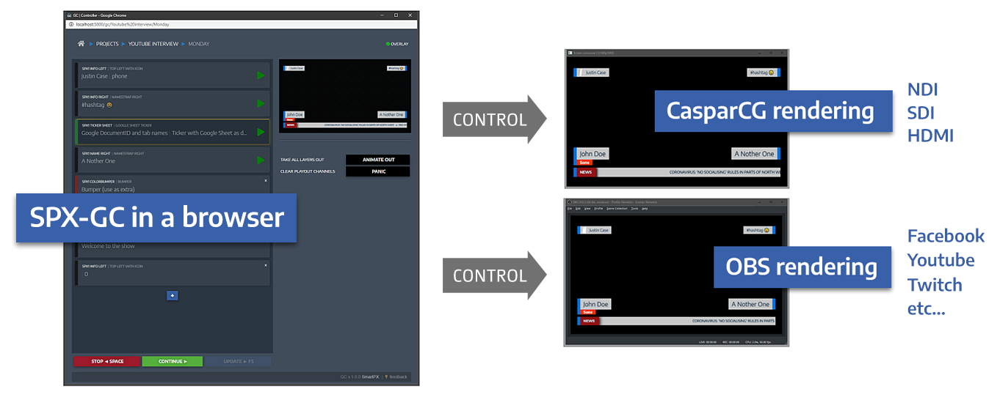


<br>


### Table of Contents

- [LIVE DEMO](#demo) 🔥 and [Template TestDrive](#testdrive) 
- [Screenshots](#screenshots)
- Install [pre-built packages](#builds) for Windows, Mac or Linux.  Or build from [source code](#npminstall).
- [Run multiple instances](#multipleinstances)
- [Configuration](#config)
- [Renderer parameters](#renderer)
- [UI localization](#locales)
- [Add CasparCG server(s)](#addcaspar)
- [Projects and rundowns](#dataroot)
- [HTML templates](#templates) and [template definition](#templatedefinition)
- [Custom controls](#projectextras) and [Plugins](#plugins)
- [Using SPX with OBS (or vMix, Wirecast, XSplit...)](#streaming)
- [SPX Server and https protocol ](#https)
- [Control with external devices (Stream Deck etc)](#controlApi)
- [Product roadmap](#roadmap)
- [Issues and Feedback](#feedback)
- [MIT License](#license)


**SPX Graphics Controller** can be used to playout lower thirds, bumpers, logos and other on-screen graphics in live web streams or live TV broadcasts. Playout happens using "renderer" URL's from the SPX Server. The live output can be used in various softwares, such as OBS, vMix or CasparCG using the "browser source" approach.

Content for the graphic templates are entered into _elements_ which are stored on _rundowns_ within _projects_.

Software is based on a NodeJS server and can be run on Windows, Mac or Linux computers, on-premise or using cloud instances for remote production scenarios.

Graphic templates are typical HTML templates used with CasparCG and other HTML compatible renderers. Integrating existing templates with SPX is done by adding _a template definition_ (javascript-snippet) to them.

Originally SPX was developed for [YLE](https://www.yle.fi), a public broadcaster in Finland. The first version was released in September 2020. Thanks **Markus Nygård** and **Martin Huldin** for the challenge! 🤘

> If you need custom graphics or workflows, please [contact us](https://spx.graphics/contact).

---

<BR>

<a id="demo"></a>
## Live demo 🔥
~~Live SPX demo in the cloud: **http://demo.spx.graphics:5000**~~

🔴 _Live demo is OFFLINE at the moment._

> Please be aware there is just _one instance_ running for demo purposes, so expect clashes and overall quirky experience if multiple users are logged in at once. Changes made in demo are reset automatically few times a day. (Also pay attention to the version number, it may not be the latest version.)


<BR>

<a id="testdrive"></a>
## Template Store & Testdrive 🔥
A marketplace for free and premium SPX templates and plugins is at [spx.graphics/store](https://spx.graphics/store). Each store item can be testdriven, see these examples:

| Template | Type | Link |
| ------ | ------ | ------ |
| **[Bug](https://www.spx.graphics/store/Bug-p291293870)** - You have logo. Why not show it?  | Free | [Test drive](http://demo.spx.graphics:5009/show/Template%20Demo%20-%20Bug) |
| **[ImageLayer](https://www.spx.graphics/store/ImageLayer-p291331877)** - Pick an image and play.  | Free | [Test drive](http://demo.spx.graphics:5009/show/Template%20Demo%20-%20ImageLayer) |
| **[Texter](https://www.spx.graphics/store/Texter-p291207513)** - An essential template for unbranded text.  | Premium | [Test drive](http://demo.spx.graphics:5009/show/Template%20Demo%20-%20Texter) |
| **[TwoTone](https://www.spx.graphics/store/Two-Tone-p245011856)** - You have logo. Why not show it?  | Premium | [Test drive](http://demo.spx.graphics:5009/show/Template%20Demo%20-%20Two-Tone%20Pack) |
| And much more ▶ [spx.graphics/store](https://www.spx.graphics/store)  |  |  |
<BR>
> Please be aware: just _one instance_ running for demo purposes, so expect clashes and overall quirky experience if multiple users are logged in at once. Changes made in demo are reset automatically few times a day.


<BR>

# Screenshots <a id="screenshots"></a>
|  | |
| ------ | ------ |
| 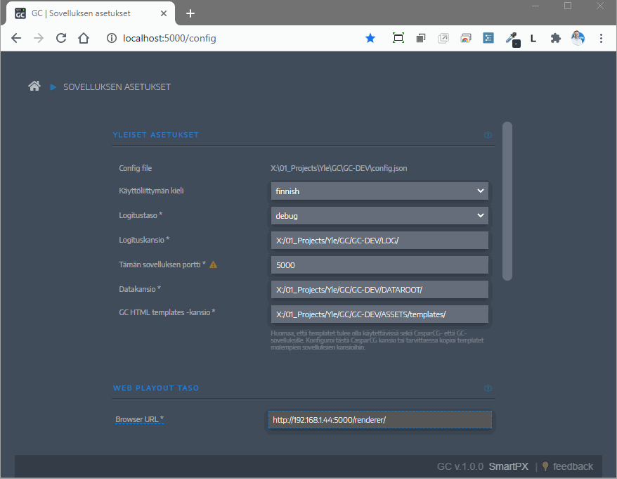 | SPX's UI is browser based and can be operated with a mouse or keyboard. Additonal _extra controls_ can be added as _plugins_ to execute specific tasks or to trigger events in external devices. |
| 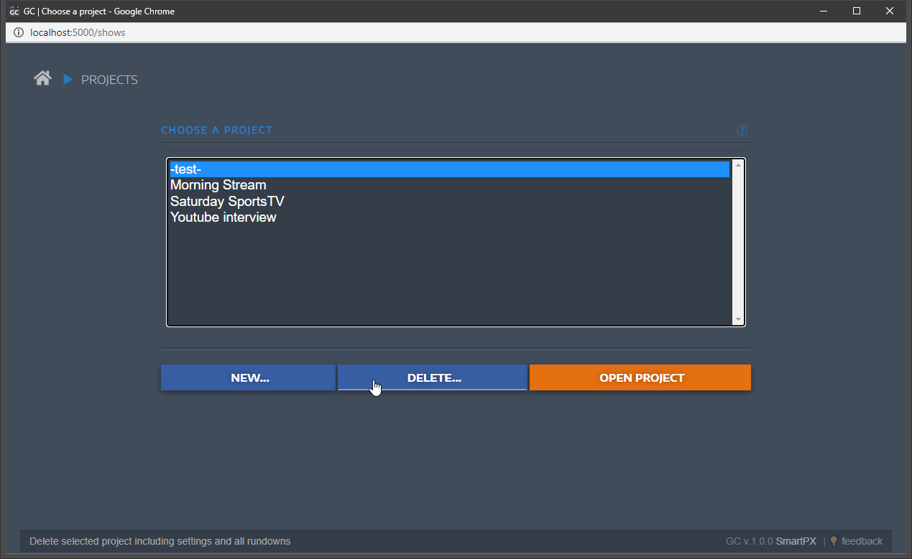 | Content is managed in _projects_. Each project can have unlimited amount of _rundowns_ and _graphics templates_. Projects and their rundowns and settings are stored in _dataroot -folder_. |
| 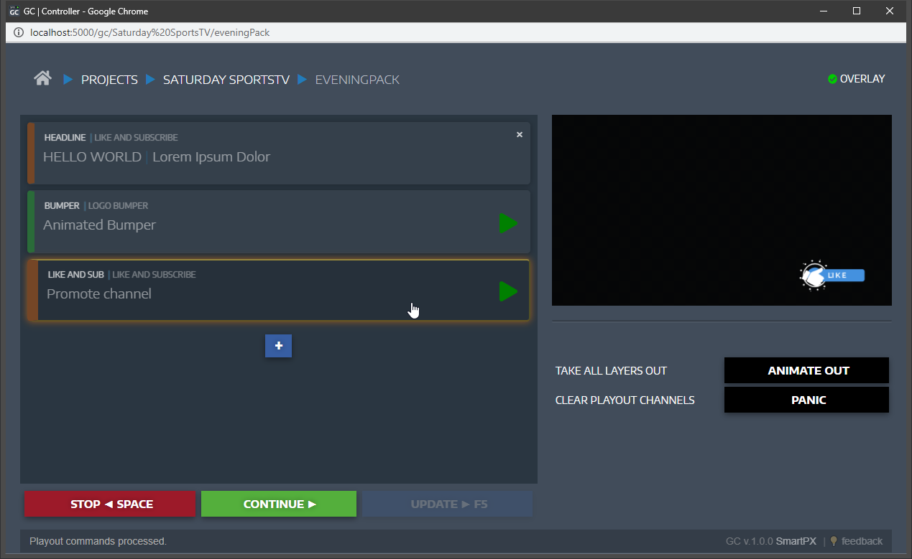 | Main Controller: rundown with few items and a local preview. Items can be edited and controlled also with keyboard shortcuts. Fullscreen viewing mode recommended. Buttons below preview are customizeable. | 
| [](https://www.youtube.com/watch?v=e5LTFC9MlOI) | An introduction video on Youtube. There are more images in the screenshots -folder.  | 
| [](https://youtu.be/Ruxz4DACDT4) | A showreel of SPX Graphics.  | 

----


<BR>

# Installation <a id="install"></a>

SPX can be installed using a **ready-to-go binary package** which includes all required software components. Developers can alternatively get the full source code and run SPX with `npm scripts`, see section [install source code](#npminstall).

>Source is updated more frequently than binary packages. See [package.json](package.json) file for current version.


<BR>

### **Available pre-built packages:** <a id="builds"></a>

| Package| Build date | Notes |
|  ------ | ----- | ----- |
| **Windows**<BR>[SPX_1_2_1_win64.zip](https://storage.googleapis.com/spx-gc-bucket-fi/installers/1.2/SPX_1_2_1_win64.zip   ) | Sep 20 2023 | The app is cross-platform and is mostly developed and tested on Windows. Approx 57% users are on Windows.
| **Linux**<BR>[SPX_1_2_1_linux64.zip]( https://storage.googleapis.com/spx-gc-bucket-fi/installers/1.2/SPX_1_2_1_linux64.zip ) | Sep 20 2023 | Tested with some flavours of Debian and Ubuntu but user's input is appreciated here, see [feedback](#feedback). 32% of users are on Linux|
| **MacOS**<BR>[SPX_1_2_1_macos64.zip]( https://storage.googleapis.com/spx-gc-bucket-fi/installers/1.2/SPX_1_2_1_macos64.zip ) | Sep 20 2023 | If any installation issues, please see this [Knowledge base article](https://spxgc.tawk.help/article/spx-gc-installation-steps). 11% of users are on Mac.|

> For links to older packages see [RELEASE_NOTES](RELEASE_NOTES.md).
 Please [get in touch](#feedback) if you have problems downloading or installing these files.

## Option 1: **Install a pre-built package**
* Download a zip-file for your system using one of the links above.
* Create a new folder for the app (for example on Windows `C:\SPX\`, or on Linux `/SPX` ).
* >**PLEASE NOTE** if using `C:\Program Files\` folder on Windows you may need to start SPX with administrative priviledges, since SPX will generate files in that folder structure.  
* >**AVOID SYMBOLIC LINKS** Some filesystem related operations are known to fail is SPX (at least on Windows) when using `SUBST` or `net use` to assign a drive letter to a folder. 
* Extract the zip-file to that folder.
* Locate the executable (for example `SPX_win64.exe` on Windows) and double click it to start the SPX server. A console window should open (and remain open) and show some startup information.
* Chrome browser can be enabled to launch automatically at server start-up. See `launchcrome` setting in [config.json](#config).
* When running application the first time it will create a file structure shown in the below screenshot. Note: unzipping and running SPX does _not_ usually require admin priviledges (See note above).
* **On Linux** you _may_ need to add execute permission to the file (`sudo chmod a+x SPX_linux64`) and launch it in a console (`./SPX_linux64`). See this [KB article](https://spxgc.tawk.help/article/make-executable)
* **On MacOS** you _may_ need to add execute permission to the file (`sudo chmod a+x SPX_macos64`) and launch it in the Terminal (`./SPX_macos64`). See this [KB article](https://spxgc.tawk.help/article/make-executable)
* See next steps in the section [first launch](#firstlaunch).

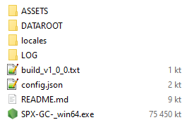


## Option 2: **Install from source code** <a id="npminstall"></a>

Developers can get the source code from the repository with [git](https://git-scm.com/) and run the application using [NodeJS](https://nodejs.org/) and [npm](https://www.npmjs.com/).

> **PLEASE NOTE:** The source code in this repository is always in a <span style="color:red;">**WORK IN PROGRESS**</span> state and features may or may not work. For production work it is recommended to always use known [prebuilt binaries](#builds), which are more carefully tested. See also [Release Notes](RELEASE_NOTES.md).

* Create an empty folder on your system and fetch the source code using a `git clone` command:
```sh
git clone https://github.com/TuomoKu/SPX-GC.git
```
* After downloading the source, install required additional dependencies (node_modules) with

```sh
npm install
```
* See `package.json` for available scripts, but in **development** the typical start script would be `npm run dev` which will use _nodemon_ to restart the server when changes are made to source files.
```sh
# on Windows:
npm run dev

# Or without hot reloading:
node server.js

```
### pm2 process manager<a id="pm2"></a>
* Installation of `pm2` process manager ([https://pm2.keymetrics.io/](https://pm2.keymetrics.io/)) can help in advanced production scanarios.
* To run the server in **production mode** use `npm start` which will run the server in the background with `pm2` process manager which will automatically restart the server if a crash occurs. Deeper usage and configuration options of _pm2_ is outside the scope of this readme-file. 

```sh
npm start
```

### Run multiple instances<a id="multipleinstances"></a> 
* To run several instances of SPX (on different ports) with `pm2` prepare a `ecosystem.config.js` -file to same folder as config.json with details of each instance, such as:
```javascript
// Example "ecosystem.config.js" file for pm2 to run multiple instances of SPX.

module.exports = {
  apps : [
    {
    'name': 'GC1',
    'script': 'server.js',
    'args': 'config.json'
    },
    {
      'name': 'GC2',
      'script': 'server.js',
      'args': 'config5001.json'
      }
  ]
};

```
Then launch multiple instances with pm2:
```sh
pm2 start ecosystem.config.js
```
Stop all running instances 
```sh
pm2 kill
```


---
# First launch <a id="firstlaunch"></a>
* When the app is started the very first time a default browser is launched with SPX user interface open
* In the subsequent server starts use a web browser (such as Chrome) and load SPX gui from URL shown in the console at the start-up.
* With `general.launchBrowser = true` flag the browser can be opened every time automatically. This is set to false by default.
```
  ╭───────────────────────────╮
  │ Open SPX in a browser:    │
  │ http://127.0.0.1:5656     │
  ╰───────────────────────────╯
```
> Port 5656 is the default value in config and can be changed.

If installation and server start-up worked, you should see a Config screen in your browser asking a preference regarding user access.
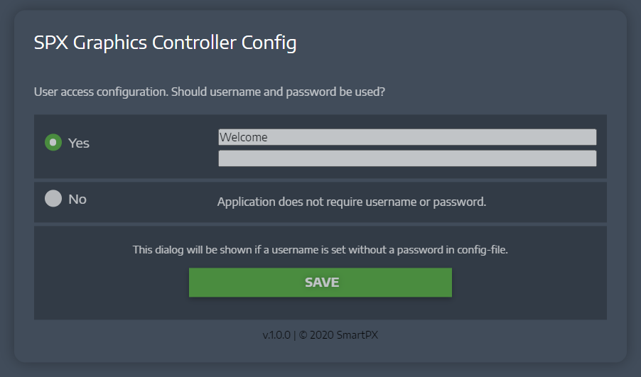
There are two alternatives:
  * **`YES`**: Username and password are reguired to access the application.
  * **`NO`**: Application will not require a login.
  * This config screen is shown
    * at first startup, or
    * when `config.json` is missing, or
    * when `config.json` **has** username but password is left **empty**

Depending on the selection made, you will either be asked to login or you land to the Welcome page and you are free to explore the application. If password is given it will be stored in the config-file in unreadable, encrypted format.

> By default the dataroot has one "Hello world" -project with "My First Rundown" in it for demonstration purposes.

Start making [configuration changes](#config) or creating [projects](#dataroot) and adding [templates](#templates) and adding those to [rundowns](#rundown) for playout.

**You can also follow these steps to get yourself familiarized with the application:**

1. Open SPX in browser, typically at http://localhost:5656
2. Choose 'no login' policy by selecting **No** option and click **Save**
3. Go to **Projects**
4. Add a new project, for instance `My First Project`. (Project's settings opens.)
5. Click **[ + ]** button to add the first template to the project
6. Browse to `softpix > Template_Pack_1` -folder and choose `SPX1_INFO_LEFT.html` -template
7. Go back to **Projects**
8. Double click `My First Project` to open it
9. Add a new rundown to this project, for instance `My First Rundown`. (The new empty rundown opens.)
10. Click **[ + ]** button to add an item to the rundown
11. Pick **SPX1_INFO_LEFT** -template
12. Double click rundown item to edit it, enter "Hello world!" and click **Save** to close the editor
13. Play the item with **SPACEBAR** or by clicking on **PLAY** button at the bottom of rundown list.

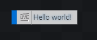

Congratulations! Now go back to your project's settings and add more templates to it...

> When a new version becomes available it will be shown on the Welcome page of the application.


# App configuration options <a id="config"></a>
> Application **DOES NOT** come with `config.json` and it will be generated at server start up.

SPX uses a `JSON file` to store configuration settings, such as folder paths, playout server settings or user interface language options. Most of the settings can be changed from the configuration page.

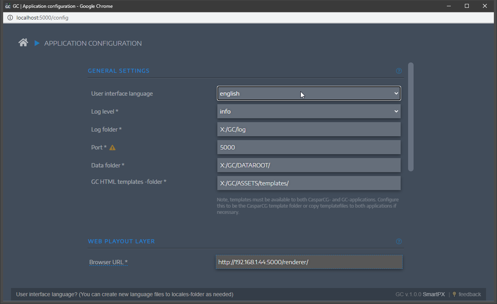

Some rarely used settings are left out from configuration page and can be changed by manually modifying the _config file_ in a text editor.


The default configuration file name is `config.json` but it is possible to run the server with a specific configuration file. For instance you might have two instances running on the same system, using shared project files and templates but on different server ports and using different renderers. (See also [pm2 process manager](#pm2))

To run the server with another config, provide the config file as the first command line argument, for example:
```sh
SPX_win64.exe myOtherConfig.json
```


An example `config.json` of the SPX server
```json
{
  "general": {
    "username": "admin",
    "password": "",
    "hostname": "My main machine",
    "langfile": "english.json",
    "loglevel": "info",
    "logfolder": "X:/SPX/LOG/",
    "port": "5656",
    "dataroot": "X:/SPX/DATAROOT/",
    "templatesource": "spx-ip-address",
    "preview": "selected",
    "renderer": "normal",
    "resolution": "HD",
    "launchBrowser": false,
    "disableConfigUI": true,
    "apikey": "",
    "disableLocalRenderer": false,
    "disableSeveralControllersWarning": false
  },
  "casparcg": {
    "servers": [
      {
        "name": "OVERLAY",
        "host": "localhost",
        "port": "5250"
      },
      {
        "name": "VIDEOWALL",
        "host": "128.120.110.1",
        "port": "5250"
      }
    ]
  },
  "globalExtras": {
    "customscript": "/ExtraFunctions/demoFunctions.js",
    "CustomControls": [
      {
        "ftype": "button",
        "bgclass": "bg_black",
        "text": "ANIMATE OUT",
        "fcall": "stopAll()",
        "description": "Take all layers out"
      },
      {
        "ftype": "button",
        "bgclass": "bg_red",
        "text": "PANIC",
        "fcall": "clearAllChannels()",
        "description": "Clear playout channels"
      }
    ]
  }
}
```
>**Please note**: the server will fail to start if config is not valid JSON. You can use [JSONLint](https://jsonlint.com/) to validate JSON data.

## Config parameters

**`general.username / password`** If _username_ is present but the _password_ is left blank, the app will ask for login policy, just as with [first launch](#firstlaunch). When both are entered the _password_ is saved here (encrypted) and a logic is required to start a session.

**`general.hostname`** _Mostly for future use_ This will identify SPX instance for logging purposes.

<a id="templatesource"></a>
**`general.templatesource`** (Added in v 1.0.9) For CasparCG playout the templates can be loaded from the _filesystem_ or via _http-connection_ provided by SPX. Supported values are:
* `spx-ip-address` to automatically use SPX's IP address and http -protocol for playing out templates from SPX's template folder. This is the default behaviour.
* `casparcg-template-path` to playout templates from target CasparCG server's file system template-path. (See _caspar.config_ file) Note, in this workflow the templates *must be in two places*: in SPX ASSETS/templates -folder *and* CasparCG's templates folder. And if a changes are done to either location, those changes should also be done to the other. `rsync` or other mirroring technique should be considered...
* `http://<ip-address>` manually entered address can be used when the automatically generated IP address is not usable. For instance Docker containers or VM hosted instances may expose internal IP address which can not be accessed from outside.
> Please note _templatesource_ only affects CasparCG playout and not web playout. Also file:// protocol is more restrictive in using external data sources and it can yield javascript errors, such as CORS. 

**`general.preview`** Version 1.1.0 introduced the first implementation of preview. Any output renderer is treated as a preview renderer if `preview=true` parameters is present in the renderer URL. CasparCG preview server is not implemented in v.1.1.0 but the `renderer?preview=true` URL can be added to CasparCG "manually" using ACMP protocol commands. 
`Preview` value dictates which event on the rundown triggers a preview in a the preview renderer. Values available:

* `selected` (the default value) Preview will play whenever a _focus_ is changed on the rundown.
* `none` preview will not be triggered
* ~~`next`~~ Preview will play _the next item_ from the rundown when an item is played. (Option coming later) 

**`general.renderer`** Version 1.1.0 introduced an option to have the local renderer in traditional position at the top right corner of SPX UI **or** taken out to a floating window. This is stored to config file and each consecutive controller reload will act according to set preference. Possible values are

* `normal` an inline renderer view
* `popup` renderer in a floating window "popup" (notice, it is possible that popup blocker prevent this from working as expected)

**`general.resolution`** Version 1.3.0 introduced a new option for affecting output from SPX. Please note this is the renderer viewport size, templates will *also* need to support set size and aspect ratio. Most templates are implemented, or optimized, for 16:9 aspect ratio and 1920x1080 output size.

* `HD` = 1920 x 1080 pixels (16:9)
* `4K` = 3840 x 2160 pixels (16:9)
* `AUTO` = Full output height and width of the browser viewport rendering the template. Please note most SPX templates are prepared for 16:9 HD output and if using other sizes, this may require changes in the template sizing and layout properties. Typically used term for these kind of HTML layouts is "responsive design".
 
<a id="locales"></a>**`general.langfile`** is a file reference in `locales`-folder for a JSON file containing UI strings in that language. Folder is scanned at server start and files are shown in the configuration as language options. There are some hardcoded strings in the UI still which are gradually improved. Some texts are "user settings" (plugin and extension UI texts, template instructions) and cannot be added to the locale strings.

If you are interested in translating SPX user interface to your local language please see [SPXLocaleEditor](https://github.com/TuomoKu/SPXLocaleEditor) repository for a browser based utility for modifying locale-files.

Localization credits:
| Language | Contributor | Bundled in version |
|  ------ | ----- | ----- |
|  Dutch | Koen Willems, Netherlands | v1.0.12 |
|  Chinese | Anosi Wang, China | v1.1.0 |
|  Swedish | Christina F., Finland | v1.1.2 |
|  Portuguese | Joao M., Portugal | v1.1.2 |
|  Japanese | Masakazu Nakano, Japan | v1.3.0 |

<BR>


<a id="log"></a>**`general.loglevel`** default value is `info`. Other possible values are `error` (least), `warn`, `verbose` and `debug` (most log data). Log messages are shown in the SPX console window and are stored into log files in logfolder. The active file is named `access.log`. Log files can be useful in troubleshooting, `verbose` is the recommeded level for troubleshooting. If further analysis is needed `debug` level produces even more information. Remember to set log level back to `info` since heavy logging will increase disk usage and may effect software performance.

<a id="globalextras"></a> **`globalExtras{}`** are additional user interface controls, or _plugins_, shown below preview window in all project as opposed to [projectExtras](#projectextras) which are project specific. Each item has an UI component (a button) and associated function call available in the specified `javascript file`. When a new `config.json` is created it has some demo extra controls to introduce related consepts and possibilities.
> **PLEASE NOTE:** Global extras will be replaced by [Plugins](#plugins) in future versions, since they are easier to install and maintain.

<br>

## Adding CasparCG server(s)<a id="addcaspar"></a>

> ⚠ If SPX is used with CasparCG **version 2.3.x LTS is recommended.** See [CasparCG Releases](https://github.com/CasparCG/server/releases).

Starting from v.1.0.12 SPX does not have a CasparCG server assigned by default in the [configuration](#config). To add CasparCG server(s) go to Configuration and scroll down to CasparCG servers. Add a new server by giving it name such as `OVERLAY`, `ip-address` (or `localhost`) and a `port` number (5250 is CasparCG's default port). Click on Save at the bottom of the page and there will be an empty line to add another server. Add as many as you have in your production, such as OVERLAY (for CG's), VIDEOWALL, FULLSCREEN etc... 

> The name `OVERLAY` is preferred, since this name is used in all [SPX Store](https://spx.graphics/store) templates and the default template pack which comes with the application. **Note:** use only alphanumeric names for CasparCG servers, without special characters or spaces.

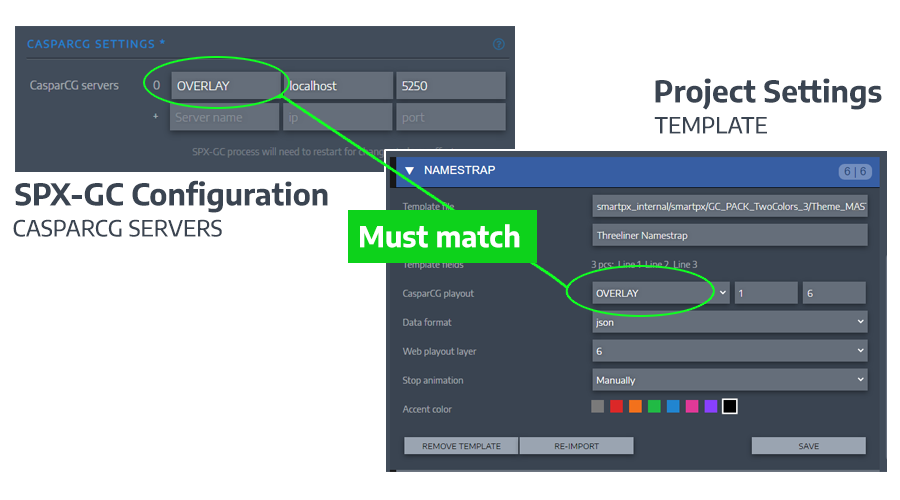

Each SPX template has a setting for choosing a target CasparCG server. This server is assigned in the template settings within Project Settings. (Default value comes to the project from the HTML sourcecode of the template as the 'playserver' -parameter of the TemplateDefinition object.) The name must match with one of configured servers for the playout to work.

SPX has three options for loading templates, see section about configuring [template source folder](#templatesource) for more info.

If you have problems during playout it is recommeded to [set log level](#log) higher and observe SPX console window messages for potential cause.

<!-- 
During production if server name is not found there will be an error message on the console: 
```js
// Error message if CasparCG server is not configured
Template requests CasparCG server [SERVERNAME] but a server by that name was not found in SPX configuration. Make sure app configuration and project settings match. This does not effect web playout.
```
-->

> **REMEMBER** SPX server process must be restarted whenever changes are made to configuration. 

<br>

# Renderer parameters <a id="renderer"></a>
SPX renderer is at `/renderer` URL and it supports additional parameters for specialized workflows. In a typical use (such as 16:9 single renderer production) these can be safely ignored.

| Parameter | Datatype | Example | Remark
|  ------ | ----- | ----- | ---- |
|  `layers` | Array of numbers | `[1,2,3,4,20]` |
|  `preview` | Boolean | `true` |
|  ~~`width`~~ | ~~integer~~ | ~~`1920`~~ | Removed in 1.3.0
|  ~~`height`~~ | ~~integer~~ | ~~`1080`~~ | Removed in 1.3.0
|  `fps` | number | `50` or `29.97` | Value is passed to templates but none of the official templates uses this property at all.

An example renderer URL for _"a vertical HD-Ready screen, showing only layers 2 and 3 and at 15 fps refresh rate"_.

```
renderer/?width=768&height=1366&layers=[2,3]
```
**PLEASE NOTE:** `fps` parameter value is stored to `window.top.spxRenderer.fps` -global variable of the renderer and it's utilization requires support from the templates themselves. This value IS NOT USED by any templates at the moment developed by SPX Graphics. 

**PLEASE NOTE:** `width` and `height` parameters were removed in v.1.3.0 as Application Configuration now supports `AUTO` sizing mode that will adjust renderer size to match dimensions of the holding viewport, such as `browser size` settings in OBS or similar software.

<br>

# Projects and rundowns <a id="dataroot"></a>
All content in SPX is stored as files in `dataroot` folder which is specified in the configuration.

* **Projects** are _subfolders_ in the dataroot-folder
* **Rundowns** are _files_ in project subfolders.

Projects can be added and removed on the _Projects_ page and rundowns can be added and removed inside project on the _Rundows_ page. Most changes are saved automatically. If the UI becomes unresponsive it is usually fixed by refreshing the current page (Ctrl+R).

```
File structure of dataroot:

⏵ LOG
⏵ ASSETS
⏷ DATAROOT
   ┝━⏵ Project A
   ┝━⏵ Project B
   ┕━⏷ Project C
        ┝━━  profile.json
        ┕━⏷ data
             ┝━ Rundown 1.json
             ┕━ Rundown 2.json
```
>Typically users don't need to do any manual file management using computer's filesystem.

<a id="profile"></a>**Project specific settings**, such as assigned templates and project extras are stored into `profile.json` within each project folder.

**A static background image** can be assigned to a project in the Project Settings. A use case for this might be a chroma image to help in chroma keying in a vision mixer such as ATEM. Another creative use is to have a logo or border or other design element onscreen all the time. A transparent PNG (with an alpha channel) can be used. The background image must be placed to ASSETS/media/image/hd folder and it will appear in the dropdown.

**Templates** can be added to a project on the project settings page. When a template (a .html file) is browsed and selected, the system will scan the file and search for a [template definition](#definition) which will tell SPX what kind of input fields should be generated for that template and how the template is planned to be played out. Template defaults are stored to project's `profile.json` (as "copy") and if HTML template's definition related details are changed afterwards the template must be imported to the project again. The system does not re-scan added templates.

> If selected template does NOT have template definition it will cause an `error:templateDefinitionMissing` -message. See section [html templates](#templates).

<a id="projectextras"></a> **showExtras** are additional user interface controls, or _plugins_, shown below preview window in current project as opposed to [globalExtras](#globalextras) which are shown in every project. Each item has an UI component (a button) and associated function call available in the specified `javascript file`.

<a id="variables"></a> **projectVariables** are advanced properties introduced in v.1.1.1. Variables can be used to drive a shared value across several templates on the rundown. If a field in template definition has a `prvar` property defined when template is added to the project, this will cause a _projectVariable_ to be added (or appended to an existing projectVariable of the same name) into the project's `variables` array in `profile.json` file. The latest added template will set the default value of that variable. See example:
```json
            /* Example field in the templateDefinition */
            {
                "field" : "f0",
                "ftype" : "textfield",
                "title" : "Name of the event",
                "value" : "Fakemusic Fest 2022",
                "prvar" : "eventName"
            }
```
If several templates use a projectVariable by the same name, this template references will be added to an array. When template is removed from the project, its reference will be removed from the `users` array. See example:
```json
          /* Example variables array from profile.json */
          "variables": [
            {
              "prvar": "eventName",
              "ftype": "textfield",
              "title": "Name of the event",
              "value": "Fakemusic Fest 2022",
              "users": [
                "softpix/eventpack/lowerthird.html",
                "softpix/eventpack/agenda.html"
              ]
            }
          ]
```

<a id="projectextras"></a> **showExtras** are additional user interface controls, or _plugins_, shown below preview window in current project as opposed to [globalExtras](#globalextras) which are shown in every project. Each item has an UI component (a button) and associated function call available in the specified `javascript file`.

An example projects settings `<PROJECT>/profile.json`:

```json
{
  "templates": [
    {
      "description": "Hashtag one-liner",
      "playserver": "OVERLAY",
      "playchannel": "1",
      "playlayer": "7",
      "webplayout": "7",
      "out": "4000",
      "uicolor": "7",
      "onair": "false",
      "dataformat": "xml",
      "relpath": "myTemplates/ProjectA/hashtag.html",
      "DataFields": [
        {
          "field": "f0",
          "ftype": "textfield",
          "title": "Social media hashtag",
          "value": "#welldone"
        }
      ],
    }
  ],
  "showExtras": {
	"customscript": "/ExtraFunctions/demoFunctions.js",
	"CustomControls": [
        {
          "description": "Play simple bumper",
          "ftype": "button",
          "bgclass": "bg_orange",
          "text": "Bumper FX",
          "fcall": "PlayBumper",
        },
        {
          "description": "Corner logo on/off",
          "ftype": "togglebutton",
          "bgclass": "bg_green",
          "text0": "Logo ON",
          "text1": "Logo OFF",
          "fcall": "logoToggle(this)"
        },
        {
          "description": "Sound FX",
          "ftype": "selectbutton",
          "bgclass": "bg_blue",
          "text": "Play",
          "fcall": "playSelectedAudio",
          "value": "yes.wav",
          "items": [
              {
                  "text": "No!",
                  "value": "no.wav"
              },
              {
                  "text": "Yesss!",
                  "value": "yes.wav"
              }
          ]
        },
	  ]
	}
}
```
> The above project has just one template (`hashtag.html`) assigned with three extra controls of different types. 

Custom control's ftype can be 
* **button**: a simple push button (with `text` as caption)
* **togglebutton**: button with separate on / off states
* **selectbutton**: a select list with an execute selection button
* **ftypes**
    - `hidden` value is used, title shown
    - `textfield` a typical input field
    - `dropdown` options provided as an array
        - `"items":[ {"text": "Hundred", "value": 100}, {"text": "Dozen", "value": 12} ]`
        - `value` is one of the item array values
    - `caption` text of "value" is shown in UI. Useful with static graphics.


----

# Templates
SPX uses HTML templates for visuals.

Templates can have any features supported by the renderers, such as Canvas objects, WebGL animations, CSS transforms and animations, animation libraries, such as GSAP, ThreeJS, Anime, Lottie/Bodymovin and templates can utilize ajax calls for data visualizations and other advanced uses.

SPX comes with a starter template package for reference. See folder [ASSETS/templates/smartpx/Template_Pack_1](https://github.com/TuomoKu/SPX-GC/tree/master/ASSETS/templates/smartpx/Template_Pack_1)

Video: [Use existing HTML templates](https://www.youtube.com/watch?v=AdZATSBByng).

```
Recommended folder structure for templates

⏵ LOG
⏵ DATAROOT
⏷ ASSETS
   ┝━⏵ video
   ┝━⏵ media
   ┕━⏷ templates
        ┝━⏵ smartpx
        ┝━⏵ yle
        ┕━⏷ myCompany
             ┝━⏵ ProjectA
             ┕━⏷ ProjectB
                  ┝━⏵ css
                  ┝━⏵ js
                  ┝━ Template1.html
                  ┕━ Template2.html

```
> The templates must be within `ASSETS/templates` folder structure. It is preferred to have a single subfolder for all _your_ templates (myCompany in the example above) and futher subfolders for different _template packs_ or _visual styles_ within it (ProjectA, ProjectB in the example).

SPX user interface and web playout always loads templates from `ASSETS/templates` folder, but CasparCG playout can be [configured](#templatesources) to playout _copied_ templates from template-path folder configured in CasparCG Server caspar.config -file. 

<!--
> <a id="fileprotocol"></a>**CasparCG** does not support absolute file paths with HTML-templates using file protocol. SPX-GC loads templates from ASSETS/templates -folder which acts as a http server. (Serving templates over http to CasparCG is planned for future version of SPX-GC.) **The simplest** way currently to configure CasparCG and SPX-GC together is to make ASSETS/templates folder the templates folder of CasparCG. To make this change, move your existing HTML-templates to ASSETS/templates and re-configure `caspar.config` to use that as `templates-folder`. [Video: template path configuration](https://www.youtube.com/watch?v=bjVzdaR9a0U).

Another approach is to copy the templates to **both locations** but this can become cumbersome if changes are made to templates: the changes will need to be done to two places or those folders will need to be mirrorred somehow. See this [Wikipedia article](https://en.wikipedia.org/wiki/Comparison_of_file_synchronization_software).
-->

## SPXGCTemplateDefinition -object in templates <a id="templatedefinition"></a>

> **IMPORTANT:** Each HTML template must have an `JSON data object` present in the HTML-files source code, within the HEAD section. [Video: use existing HTML templates](https://www.youtube.com/watch?v=AdZATSBByng) covers also this topic.

TemplateDefinition configures how a template is supposed to work within SPX; what kinds of controls are shown to the operator and how the graphic should playout, on which server and layer for instance. These values are template's `defaults` and can be changed in the Project Settings view after the template is added to the project.

Theoretically all properties are optional, but it's recommended most properties, especially playout layers, are carefully given to prevent clashes during playout.

> See details about supported values below the snippet.

```html
<!-- An example template definition object for SPX. -->
<!-- Place it as the last item within the HEAD section -->

<script>
    window.SPXGCTemplateDefinition = {
        "description": "Top left with icon",
        "playserver": "OVERLAY",
        "playchannel": "1",
        "playlayer": "7",
        "webplayout": "7",
        "steps" : "1",
        "out": "manual",
        "uicolor": "2",
        "dataformat": "json",
        "DataFields": [
            {
                "ftype" : "instruction",
                "value" : "A example demo template definition. Learn what it does and make use of it's capabilities."
            },
            {
                "field" : "f0",
                "ftype" : "textfield",
                "title" : "Info text",
                "value" : ""
            },
            {
                "field": "f1",
                "ftype": "dropdown",
                "title": "Select logo scaling",
                "value": "0.3",
                "items": [
                    {
                        "text": "Tiny logo",
                        "value": "0.3"
                    },
                    {
                        "text": "Huge logo",
                        "value": "1.2"
                    }
                ]
            },
            {
                "field" : "f2",
                "ftype" : "textarea",
                "title" : "Multiline field",
                "value" : "First line\nSecond line\n\nFourth one"
            },
            {
                "ftype" : "divider"
            },
            {
                "field": "f3",
                "ftype": "filelist",
                "title": "Choose background image from global ASSETS-folder",
                "assetfolder" : "/media/images/bg/" ,
                "extension" : "png",
                "value": "/media/images/bg/checker.png",
            },
            {
                "field": "f4",
                "ftype": "filelist",
                "title": "Choose CSS stylesheet from template's relative styles-folder",
                "assetfolder" : "./styles/" ,
                "extension" : "css",
                "value": "./styles/defaultStyle.css",
            },
            {
                "field": "f5",
                "ftype": "number",
                "title": "Rotation degrees",
                "value": "45",
            },
            {
                "field": "f6",
                "ftype": "checkbox",
                "title": "Show logo",
                "value": "1",
            },
            {
                "field": "f7",
                "ftype": "button",
                "title": "Click me",
                "descr": "Describe button function here",
                "fcall": "myCustomHello('world')"
            },
            {
                "ftype": "spacer"
            },
            {
                "field": "f8",
                "ftype": "color",
                "title": "Text color",
                "value": "rgba(255, 255, 255, 1.0)"
            }
        ]
    };
</script>
```

* **playserver**: one of the available CasparCG server names in config or "-" for none
* **playchannel**: CasparCG playout channel
* **playlayer**: CasparCG playout layer
* **webplayout**: a number between 1..20, or "-" for none

> `Layer` is a number between 1..20. Layer 1 is at the very back and 20 is the highest ("closest to the camera"). Layers can be changed for each template in each project separately in the Project Settings.

* **out**: how layer should be taken out:
  * `manual` default way: press STOP to animate out
  * `none` play only. Suitable for wipes / bumpers
  * `[numeric]` milliseconds until STOP is executed
* **steps**: how many phases in animation? For normal in-out templates this is 1. For templates with 2 or more steps the _Continue_ button gets enabled.
* **dataformat**: how template logic is expecting data
    - `json` the default value (from 1.2.2)
    - `xml` for compatibility with older CasparCG templates
* **ftypes**
    -  _ftypes_ (for field types) define template's GUI controls in SPX controller
    - the values of first two fileds are used as content preview in the rundown, so the order of fields should be considered for the ease of use
    - The developer of the HTML template can consider how to utilize these values, for instance a `dropdown` control can be used to pick the name of the show host, or it can drive other values via javascript in the templates. See /ASSETS/templates/smartpx -folder for some inspiration.

| Field type |  Description | Example |
| ------ | ------ | ----- |
| `hidden` | A variable which is not editable by the user. _Value_ is used by the template and, _title_ shown as static text on UI. | `Red color (#f00)`  |
| `caption` | The _value_ is shown in UI. Caption can be used to display texts to operators of the template. | `This template does not have editable values` |
| `textfield`  | A typical single line text input field. | `Firstname Lastname` |
| `dropdown` | A dropdown selector list. Options is an _items_ array, each consisting of _text_ (which is visible) and the  _value_ (which the template will use). The default selection is defined as `value` and it must be one of the values in the _items_ array. See an example definition above. | `"items":[ {"text": "Hundred", "value": 100}, {"text": "Dozen", "value": 12} ]` |
| `textarea`  | A multiline text control which accepts _return_ key for new lines. (Added in 1.0.2)| `First line \n Second line` |
| `filelist` | A dropdown selector list for files of of given type _extension_ in an _assetfolder_ within ASSETS -folderstructure of SPX. This is useful for picking images or other media files in templates. (Added in 1.0.3). Version 1.0.15 introduced _relative folders_. If `assetfolder` path value starts with `"./"` the path is considered relative to the template root folder. This is useful for optional CSS styles or alternative images. See examples of both path styles above. | `sport_logo.png, news_logo.png` |
| `divider` | A utility ftype to add a visual divider to a template. Can be used to create visual seqments for ease of use. (Added in 1.0.3) | |
| `instruction` | _Value_ can be used as a longer help text on the template but does not have any other functionality. (Added in 1.0.6) | `Max 100 characters to the field below.`  |
| `number` | _Value_ is exposed as a number field in the template UI. (Added in 1.0.7) | `45`  |
| `checkbox` | `Title` is used as label in UI. _Value_ is "0" or "1" when checked. (Added in 1.0.10) | `[x] Show logo`  |
| `color` | `Title` is used as label in UI. _Value_ is a valid CSS color string such as `rgb(255,0,0)` (full red) or `rgba(0,0,0,0.33)` (black with 33% opacity). (Added in 1.1.1)<BR>_**Please note**: The Color Picker UI feels a bit flaky, color may need to be selected two or more times for it to register as intended. This may improve in future versions._| `rgba(255,255,255,1.0)`  |
| `spacer` | Just an empty line to separate out sections. This can be used in very complex templates to visually separate control groups (Added in 1.1.2) | `(no parameters)`|


> **Note** additional user interface controls may be added in future releases.

## Anatomy of an example rundown item
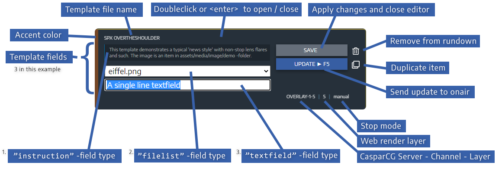


----
# Using SPX with OBS / vMix / Wirecast... <a id="streaming"></a>
SPX's animated graphics and overlays can be integrated used in streaming and videoconferencing with any video- or streaming application which has a support for "Browser" or "HTML Sources". SPX provides a URL address which is entered to the streaming software as a layer / input / source. In OBS use `Browser source`, in vMIX it's called `Web Browser input` and in XSplit it's a `Webpage source`... 
```
http://localhost:5656/renderer
```

If you have several inputs (for instance for multiple presenters) you can limit which layers get's rendered to different screens with the `layers` parameter in Renderer url, for instance:
```
http://localhost:5656/renderer/?layers=[2,4,20]
```

See [Youtube video](https://www.youtube.com/watch?v=YwXYWadiFoE) on using SPX with OBS.

<br>

----
# SPX with https protocol <a id="https"></a>
Originally SPX was designed for local, on-site installation and usage, but more and more production is done via the cloud where a secure data transfer and the use of https protocol is a must. SPX can work with https, but it will require a bit of setup.

Please read our Knowledge Base [article about https with SPX Server](https://spxgc.tawk.help/article/https-protocol).

----
# Control SPX with external devices such as Elgato Stream Deck... <a id="controlApi"></a>


SPX (v.1.0.8+) rundowns can be loaded and controlled with external devices with http GET/ POST commands. 
See available commands here:

```
http://localhost:5656/api/v1
```

See an article on using the SPX API: https://spxgc.tawk.help/article/help-api and download a sample project for developing your own custom SPX Extensions.

SPX can also be used with Bitfocus Companion, see https://bitfocus.io/companion. Companion version 2 will have a built in module with presets for SPX.

> **OSC -protocol** is not supported in SPX 1.0.x but will be added in a future version.

# Plugins and Extensions <a id="plugins"></a>
Version 1.0.10 introduced `ASSETS/plugins` -folder for additional functionality, such as custom function triggering `plugin buttons` and `extensions` which are additional user interfaces or panels. For instance [Scoreboard](https://www.spx.graphics/store/Scoreboard-plugin-p313595701) is a sports clock extension with an independent user interface. Another example is a SocialPlayout - an upcoming extension for moderating and LIVE playout of social messages from various social media platforms, such as Twitter, Instagram, Facebook, Youtube, etc.

Each plugin has a subfolder with at least an init.js file and optionally other folders and files, such as html, css and js.

`plugins/lib` -folder contains common SPX user interface elements used by plugins. More functionality and UI controls will be added here in future releases. These can be checkboxes, dropdown selectors etc.


# Issues and Feedback <a id="feedback"></a>

**A Knowledge Base** at [spxgc.tawk.help](https://spxgc.tawk.help/) is a growing collection of self-help articles in various SPX related topics.


**Github** [issue tracker](https://github.com/TuomoKu/SPX-GC/issues) should be used for bug reports. For other feedback such as feature requests or other comments (for now at least) please use Google Forms feedback form at <A href="https://forms.gle/T26xMFyNZt9E9S6d8">https://forms.gle/T26xMFyNZt9E9S6d8</A>. All constructive feedback is highly appreciated!


### _Gotcha's & Known Issues_ (things to be aware of)
- If UI becomes wonky reload the view (F5 / Ctrl+R).
- There is spagetti code whenever worked tired. Try to accept it...
- Undocumented features do exist. (templateEvents, TTS, pm2, cfg:hostname/usercommapass/greeting...)
- This list shouldn't be. At least not here.

----

# Roadmap <a id="roadmap"></a>
New releases will try address found issues and bugs in older versions and they will also introduce new features and functionality. See table for some planned features and use [feedback](#feedback) to submit suggestions.

> **DISCUSS FEATURES:** Visit [spx.kampsite.co](https://spx.kampsite.co) to discuss and propose new features and vote them up 🚀

<small>When a new version becomes available it will be promoted on the Welcome page of the application (if access to internet). Several versions can be installed (into different folders) and if there are no backwards compatibility issues between versions they can be configured to use the same dataroot -folder for projects/rundowns. </small>


| Release | Planned features (subject to change)| Timeframe |
| ------ | ------ | ----- |
| 1.1  | ~~Mac install folder [issue (#3)](/../../issues/3) fix~~. ~~Help page update~~, ~~internal logic change to fix [playlist item issue (#1)](/../../issues/1)~~, ~~http protocol for CasparCG templates~~, simple rundown view for mobile / tablet browsers, automatically running rundowns, item grouping, ~~textarea control~~, ~~item / file duplication~~. Project and ~~rundown~~ rename. ~~Export/import CSV~~| TBD |
| X.X  | Under consideration: OSC support, Built-in NDI support, mediafile picker, video playback control templates, ~~graphics preview~~, ~~MIDI interface~~, global extras editor in appconfig, ~~public API for controls~~, ~~HTML template store~~,  community marketplace. ~~Video tutorials.~~ ~~Knowledgebase~~. Forum. ~~Discord support channel.~~ Free lunches. | TBD |

Strikethrough items are already done.<BR>
Visit [spx.kampsite.co](https://spx.kampsite.co) to discuss the roadmap.

<BR>
----

# MIT License <a id="license"></a>
Copyright 2020-2023 Tuomo Kulomaa <tuomo@softpix.io> & [SPX Graphics](http://spx.graphics) 

This project is licensed under the terms of the MIT license.
See [LICENSE.txt](LICENSE.txt)

---

## SPX Graphics for Zoom

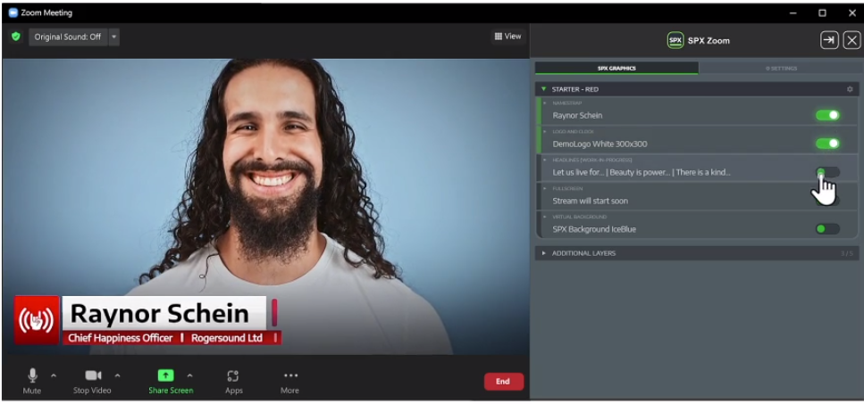

Have you seen this yet? [SPX Graphics for Zoom](https://spx.graphics/zoom)

SPX Graphics as native Zoom Marketplace application. Install for **free** and use professionally designed and animated live graphics right within the Zoom client. No need to install any software on the computer or use software switchers or virtual cameras. More designs and graphics layers can be added from SPX Store. We also provide customized graphics packages to Enterprise users. Please [contact us](https://spx.graphics/contact) for more info.

Install the app FOR FREE now: **[ Add to Zoom ](https://bit.ly/zoom-us-authorize-spx-graphics-button)**


