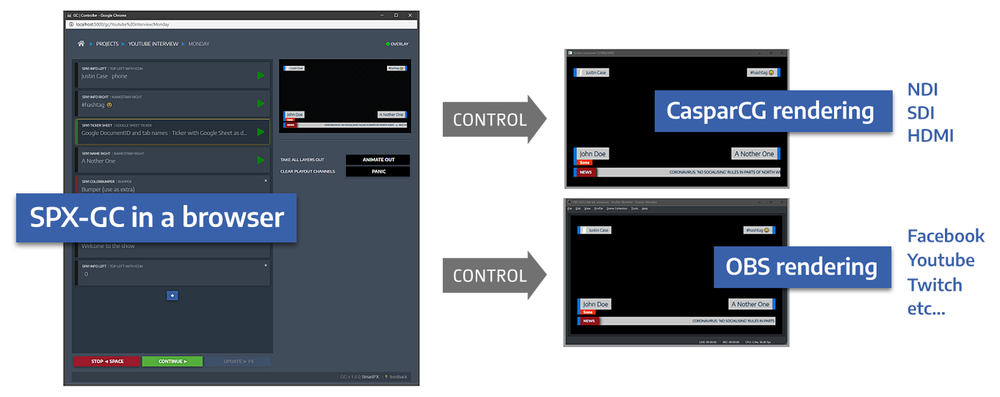
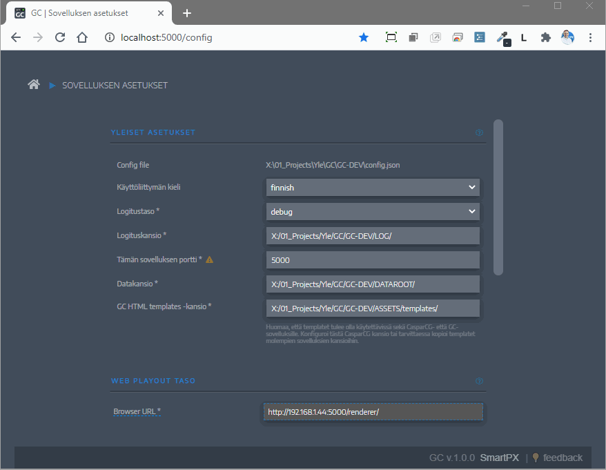
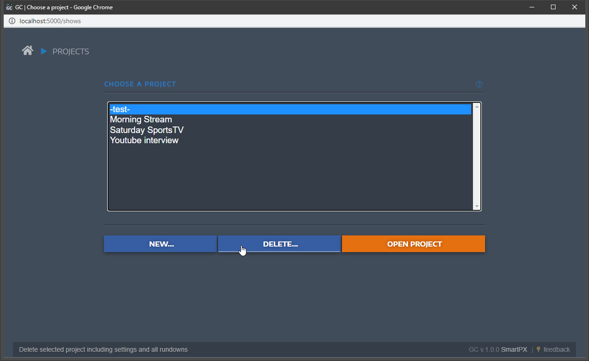
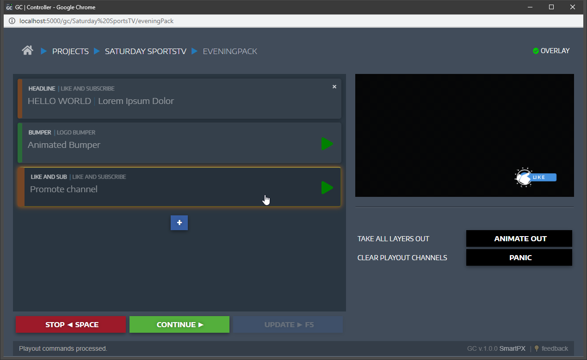
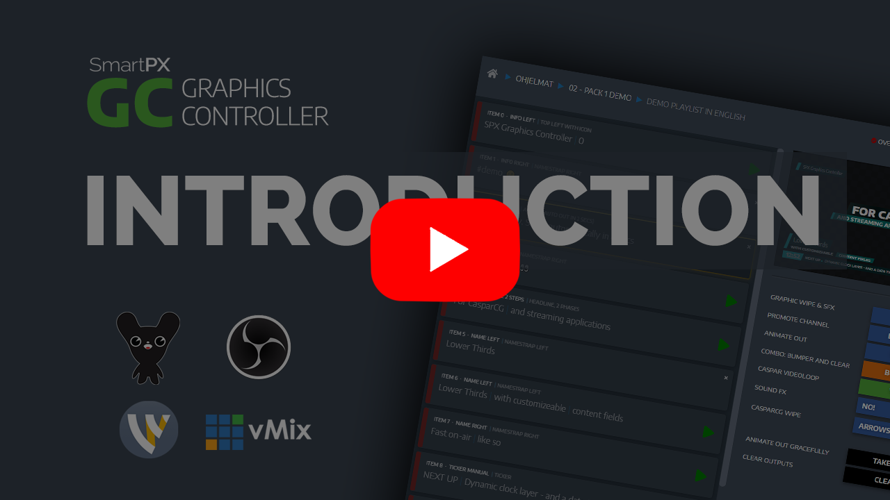
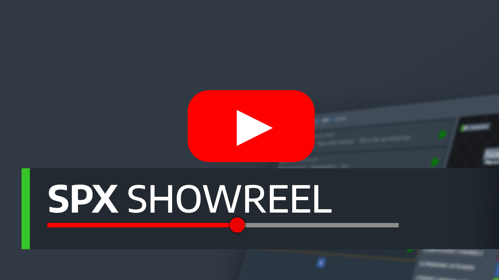
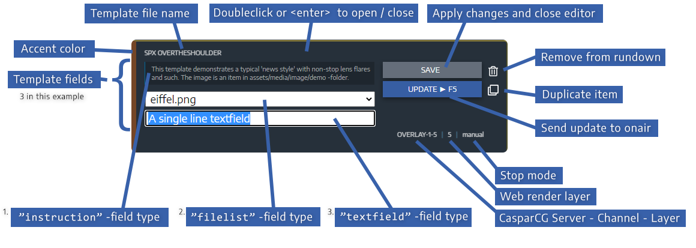

# SPX Graphics Controller

**Manage and control HTML graphics in live production.**

>  Readme updated 2026-03-09
 

## SPX in a nut shell

 **SPX Graphics Controller** is an application using web technologies for managing and for playing back realtime graphics such as lower thirds, titles, logos, news tickers and more for live streaming, live events, live TV broadcast and other productions.  SPX runs locally on your computer or in the cloud and works seamlessly with
[OBS](https://obsproject.com/?ref=spxgraphics.com),
[vMIX](https://www.vmix.com/?ref=spxgraphics.com),
[LiveU Studio](https://www.liveu.tv/products/produce/liveu-studio),
[ToolsOnAir](https://www.toolsonair.com/),
[CasparCG](https://github.com/CasparCG),
[Wirecast](https://www.wirecast.io/en/?ref=spxgraphics.com),
[XSplit](https://www.xsplit.com/?ref=spxgraphics.com), 
[MimoLive](https://mimolive.com/?ref=spxgraphics.com),
[TopDirector](https://www.topdirector.com/?ref=spxgraphics.com),
[Tricaster](https://www.vizrt.com/products/tricaster/?ref=spxgraphics.com),
[LiveOS](https://www.neton.live/products/liveos-production-suites/?ref=spxgraphics.com),
[Tellyo](https://www.tellyo.com/?ref=spxgraphics.com),
[Sienna](https://www.sienna-tv.com/newsite/?ref=spxgraphics.com),
[AWS Elemental](https://aws.amazon.com/media-services/elemental/?ref=spxgraphics.com),
[Panasonic Kairos](https://pro-av.panasonic.net/en/products/it_ip_platform/?ref=spxgraphics.com),
[Amagi](https://www.amagi.com/?ref=spxgraphics.com)
or any other video pipeline supporting HTML sources.

* **On-Premise** - SPX can run completely on-prem without internet connection
* **Simple but feature rich** - From manual playout to 100% automated workflows
* **File system based** - simple and robust architecture
* **Bring Your Design** - SPX does not come with a design tool - use your favorite tools
* **OGraf Compliant** - SPX supports EBU OGraf file format 
* **Layers and Outputs** - use several layers of realtime graphics and target different outputs
* **Extendable** - create custom graphics workflows with plugins and APIs
* **Full graphics ecosystem** - Please visit [spxgraphics.com](https://spxgraphics.com) 🌐

 

> [!IMPORTANT]
> # Full docs available at → [docs.spxgraphics.com](https://docs.spxgraphics.com)

## OPEN SOURCE VERSION

Latest version 1.4.0 (March 2026)

This repository contains the open source version of the SPX Graphics Controller. You can clone the repo and use it freely. The open source version does not contain all features or API functionalities of the commercial applications, but it can be used without any other limitations or watermarks.

See [installation instructions](https://docs.spxgraphics.com/Guides/Getting+Started/Installation).

## COMMERCIAL VERSIONS

There are commercial SPX Graphics versions for professional users with additional productivity features, API endpoints, support options, Professional Services and more.

  * **[SPX Solo](https://spxgraphics.com/software/solo)** is the open source version compiled to an easy to install software for Windows, Mac and Linux and it comes with example graphics, plugins and a launcher for easy use.

  * **[SPX Production](https://spxgraphics.com/software/production)** is targeted to professional live projects, such as events, streaming, sports and other OB-productions and has additional features for professional graphics playout.

  * **[SPX Broadcast](https://spxgraphics.com/software/broadcast)** is targeted to TV broadcasters and media companies with additional features and integration options for automated graphics workflows such as 24/7 playout and newsroom with MOS, NLE and NRCS plugins.
  
 

  > For more information visit SPX website to [compare SPX versions](https://spxgraphics.com/software#compare) or [contact us](https://spxgraphics.com/contact).

 
 

# Screenshots 

|  | |
| ------ | ------ |
|  | SPX's UI is browser based and can be operated with a mouse or keyboard. Additonal _extra controls_ can be added as _plugins_ to execute specific tasks or to trigger events in external devices. |
|  | Content is managed in _projects_. Each project can have unlimited amount of _rundowns_ and _graphics templates_. Projects and their rundowns and settings are stored in _dataroot -folder_. |
|  | Main Controller: rundown with few items and a local preview. Items can be edited and controlled also with keyboard shortcuts. Fullscreen viewing mode recommended. Buttons below preview are customizeable. | 
|  | A 20 min intro video on Youtube to learn the core concepts of the appklication.  | 
|  | A showreel of SPX Graphics.  | 

## Anatomy of an example rundown item

# MIT License 
Copyright 2020-2026 Tuomo Kulomaa & [SPX Graphics](http://spxgraphics.com). This project is licensed under the terms of the MIT license.
See [LICENSE.txt](LICENSE.txt)

